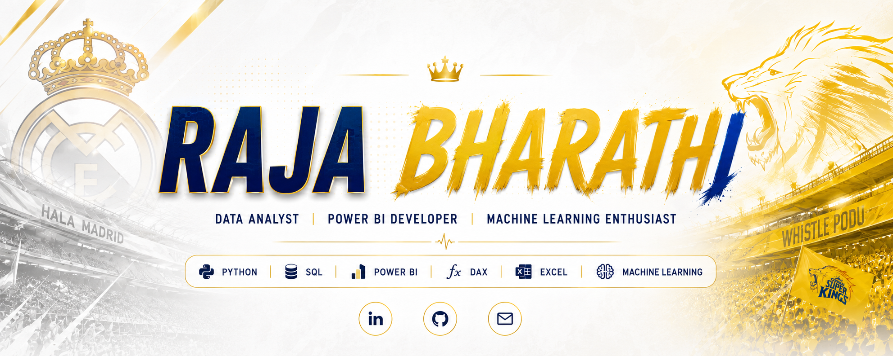

 

 

  

  
  
  
  
  

  
  
  
  

  <b>
    <a href="#-about-me">About</a> ·
    <a href="#-featured-projects">Projects</a> ·
    <a href="#️-tech-stack">Skills</a> ·
    <a href="#-github-stats">Stats</a> ·
    <a href="#-achievements--certifications">Certifications</a> ·
    <a href="#-connect-with-me">Connect</a>
  </b>

---

## 👋 Welcome

I'm **Raja Bharathi R**, a **Data Analyst** focused on **SQL, Python, Power BI**, and data visualization. I enjoy transforming raw data into meaningful insights through analysis, dashboards, and machine-learning projects.

### ⚡ Player Card

| | |
|---|---|
| 🏏 **Position** | Data Analyst &#124; Power BI Developer |
| 🏟️ **Home Ground** | Tamil Nadu, India |
| 🎓 **Training** | MCA — Data Science & AI, Guru Nanak College, Chennai (2025) |
| 🛠️ **Main Skills** | SQL · Python · Power BI · DAX · PostgreSQL |
| 🎯 **Next Match** | Data Analyst / BI Analyst / Power BI Developer roles |

---

## 👤 About Me

🎓 **MCA (Data Science & Artificial Intelligence)** — Guru Nanak College, Chennai (Graduated 2025) | **BCA (Computer Applications)**  
📍 **Tamil Nadu, India**  
💼 **Data Analyst | Power BI Developer | Machine Learning Enthusiast**  
🌐 **Portfolio:** [rajabharathi-portfolio.lovable.app](https://rajabharathi-portfolio.lovable.app/)  
🔗 **LinkedIn:** [Raja Bharathi R](https://www.linkedin.com/in/raja-bharathi-r/)  
📧 **Email:** [rajabharathi1001@gmail.com](mailto:rajabharathi1001@gmail.com)  
📄 **Resume:** [View on Google Drive](https://drive.google.com/file/d/1IcRFmYvkogss6yPHPBZDALnXSM2GSHYi/view)

I'm a Data Analyst and Data Science enthusiast with a strong foundation in data analytics, business intelligence, and machine learning. I work with **Python, SQL, PostgreSQL, Power BI and DAX** to clean data, model it, and turn it into dashboards and predictions that support decisions.

<table width="100%" align="center">
  <tr>
    <td width="50%" align="center">
      <h4>🌟 Flagship Project</h4>
      
<a href="https://github.com/rajabharathi1001-hue/ecommerce-performance-dashboard"><b>Ecommerce Performance Dashboard</b></a> Power BI · DAX · PostgreSQL

    </td>
    <td width="50%" align="center">
      <h4>🔭 Currently Working On</h4>
      
<b>Analytics projects &amp; Power BI dashboards</b> SQL analysis and my professional portfolio

    </td>
  </tr>
  <tr>
    <td width="50%" align="center">
      <h4>🌱 Currently Learning</h4>
      
<b>Advanced Power BI &amp; DAX</b> SQL, data modeling and practical data analytics

    </td>
    <td width="50%" align="center">
      <h4>🤝 Collaboration</h4>
      
<b>Data Analytics, BI &amp; ML</b> Open to Data Analyst / BI roles and new projects

    </td>
  </tr>
</table>

💬 **Ask me about:** SQL, Power BI, DAX, Python, Pandas, PostgreSQL, Excel, data cleaning, data analysis, and dashboards.

🎯 **Career Goal:** Seeking opportunities as a **Data Analyst**, **Business Intelligence Analyst**, or **Power BI Developer** where I can solve real business problems, create impactful dashboards, and support strategic decision-making.

💡 **Fun Fact:** I enjoy turning complex datasets into simple visual stories that help people make better decisions.

---

## 🚀 Featured Projects

<table width="100%" align="center">
  <tr>
    <td width="33%" align="center" valign="top">
      <h4>🛒 Ecommerce Performance Dashboard</h4>
      Power BI · DAX · PostgreSQL  
         
      <a href="https://github.com/rajabharathi1001-hue/ecommerce-performance-dashboard"><b>View Repository →</b></a>
    </td>
    <td width="33%" align="center" valign="top">
      <h4>📉 Customer Churn Analysis &amp; Prediction</h4>
      Python · Random Forest · Power BI  
          
      <a href="https://github.com/rajabharathi1001-hue/customer-churn-analysis"><b>View Repository →</b></a>
    </td>
    <td width="33%" align="center" valign="top">
      <h4>🏬 Walmart Sales Analysis</h4>
      Python · PostgreSQL · SQL  
          
      <a href="https://github.com/rajabharathi1001-hue/walmart-sales-analysis"><b>View Repository →</b></a>
    </td>
  </tr>
</table>

### 🌟 01 — Ecommerce Performance Dashboard (Flagship)

<table width="100%" align="center">
  <tr>
    <td align="center">
      
<i>Interactive Power BI dashboard for analyzing ecommerce sales, profit, orders, customer trends, product performance, and regional performance.</i>

      

        <b>Data flow:</b> PostgreSQL → Power BI · <b>Modeling:</b> relationships + custom calendar table · <b>Analysis:</b> KPIs and time intelligence
      

      

        
        
      

    </td>
  </tr>
</table>

<b>📈 What's inside (click to expand)</b>

- PostgreSQL → Power BI data integration, data preparation, relationships and data modeling
- Custom calendar table with time intelligence
- DAX measures: Total Sales, Total Profit, Order Quantity, Profit Margin, YTD Sales, PYTD Sales, YoY Growth
- KPI indicators, slicers, and interactive visuals covering sales trends, regions, customer segments, product categories and profitability
- Repo includes the `.pbix` file, Excel dataset, state latitude/longitude data, and README

---

### 📉 02 — Customer Churn Analysis & Prediction
> End-to-end customer churn analysis and prediction project combining Python, PostgreSQL, SQL, Random Forest, and Power BI.

<b>🔎 Project workflow (click to expand)</b>

1. **Data preparation:** explored the dataset, cleaned missing/inconsistent values, removed unnecessary columns
2. **SQL / PostgreSQL:** loaded data, created tables, transformed data with SQL
3. **Preprocessing:** Label Encoding for categorical variables, train/test split
4. **Machine learning:** Random Forest Classifier evaluated with accuracy score, confusion matrix, classification report and feature importance
5. **Prediction:** identified customers likely to churn and exported results to CSV
6. **Power BI:** churn trends, revenue insights, customer demographics, service usage behavior, prediction results

The repo is organized into Dashboard, Dataset, Notebook, SQL and screenshots folders.

🔗 [GitHub Repo](https://github.com/rajabharathi1001-hue/customer-churn-analysis) &nbsp;|&nbsp; 🌐 [More in Portfolio](https://rajabharathi-portfolio.lovable.app/)

---

### 🏬 03 — Walmart Sales Analysis
> Sales analysis project using Python and PostgreSQL to explore transactions, revenue, branches, products, payment methods, and sales performance.

<b>🔎 Project details (click to expand)</b>

- **Goal:** analyze Walmart sales data to understand business performance using Python, PostgreSQL and SQL
- **Analysis focus:** sales performance, customer behavior, branch performance, payment methods, product categories and other business metrics
- **Workflow:** data analysis in a Jupyter Notebook (`Walmart.ipynb`) with SQL queries written for PostgreSQL
- **Repo contents:** notebook, `walmart_sales_queries` folder for the SQL work, `requirements.txt` for the Python setup, and a project README

🔗 [GitHub Repo](https://github.com/rajabharathi1001-hue/walmart-sales-analysis) &nbsp;|&nbsp; 🌐 [More in Portfolio](https://rajabharathi-portfolio.lovable.app/)

---

## 🛠️ Tech Stack

### 🔤 Languages

### 📊 Data & BI Tools

### 📦 Libraries & Frameworks

### 🗄️ Databases

### ⚙️ Tools & Platforms

### 🧠 Core Analytics Skills
**Data Cleaning · Data Validation · Exploratory Data Analysis · Data Modeling · KPI Analysis · Time Intelligence**

### 📗 Excel Skills
**Pivot Tables · VLOOKUP · XLOOKUP · SUMIF/SUMIFS · COUNTIF/COUNTIFS · IF/IFS · Conditional Formatting**

---

## 🧩 LeetCode Problem Solving

<i>Live tracker of coding challenges and problem-solving progress.</i>

---

## 📊 GitHub Stats

  

### 🐍 Contribution Journey

<!-- OPTIONAL: contribution snake. Enable only after the "Generate Snake" workflow has run successfully
     (the `output` branch must exist), then replace the graph above with:

-->

---

## 🏆 Achievements & Certifications

### 🥇 Achievements
- ✅ Successfully completed a **Machine Learning Internship Project** through Edunet Foundation
- ✅ Passed **NASSCOM and IABAC assessments** as part of the Certified Data Scientist program
- ✅ Built multiple end-to-end **Data Analytics, BI, and ML projects** using Python, SQL, Power BI & PostgreSQL
- ✅ Developed **interactive dashboards and predictive analytics solutions** for real-world business scenarios

### 📜 Certifications

| Certification | Issuer | Year |
|---|---|---|
| Associate Data Analyst | DataCamp | 2026 |
| Certified Data Scientist (CDS) | IABAC | 2025 |
| Data Science Certification Program | DataMites | 2025 |
| Machine Learning Internship Certificate | Edunet Foundation | 2025 |
| FutureSkills Assessment Completion | NASSCOM | 2025 |

---

## 📚 Currently Learning

---

## 🤝 Open to Collaborate On

- 📊 Data Analytics & Business Intelligence Projects
- 📈 Power BI Dashboard Development
- 🤖 Machine Learning & Predictive Analytics
- 🌐 Open-Source Data Science Projects
- 🔬 Research Projects in Data Science & AI

---

## 🌐 Connect With Me

<i>Whether it's a data project, a dashboard idea, or an opportunity, my inbox is open!</i>

<table align="center">
  <tr>
    <td align="center" width="220">
      
        
      
       <b>Professional Network</b>
    </td>
    <td align="center" width="220">
      
        
      
       <b>Projects &amp; Work</b>
    </td>
    <td align="center" width="220">
      
        
      
       <b>Direct Contact</b>
    </td>
  </tr>
</table>

---

### 💡 Motto

**Turning Data Into Decisions That Drive Results.**

⭐ If you find my work helpful, consider giving a star to my repositories!

